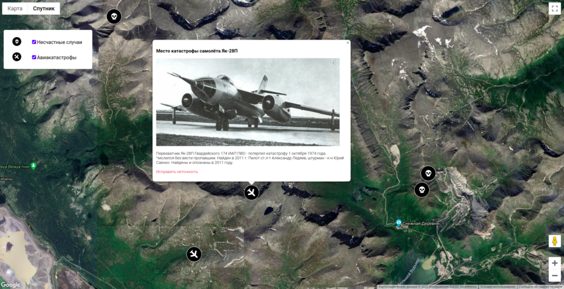

# Mountain-disasters
Web app that displays mountains air crashes and disasters on map.

# Stack
Express JS

# Quick start
On command line, type in the following commands:

        npm install        
        npm start        
 
# Development
1. Install Node 12 or later. You can use the [package manager][] of your choice.   
2. Clone this repository.
3. Run `npm i` to install the dependencies.
4. Run `npm start` to start the badge server and the frontend dev server.
5. Open `http://localhost:3000/` to view the frontend.

When server source files change, the badge server should automatically restart
itself (using [nodemon][]).

## History
The Mountain-disasters app was made as a training project in July 2020
